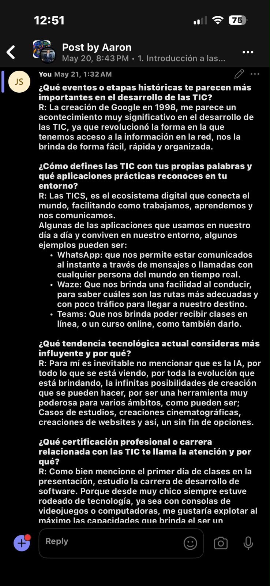
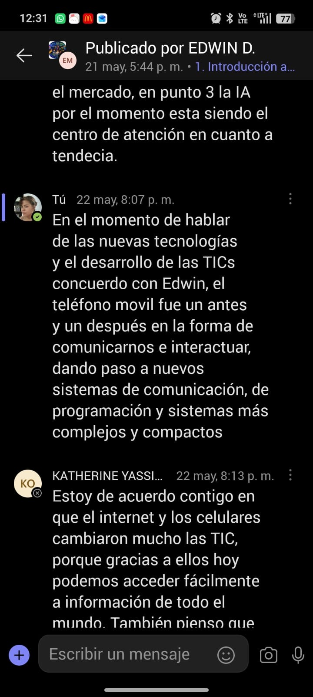

# Portafolio-de-TICs
El siguiente repositorio sirve como portafolio de evidencias de lo que hicimos en la materia durante todo el cuatrimestre.
# Portafolio de Evidencias - [Nombre de la Asignatura]

**Estudiantes:** [Jorvan Camargo], [Elkin Carrasco], [Joel Cerrud], [Yorlenis Gaitán]  
**Programa:** [Técnico Superior en Desrrollo de Software]  
**Docente:** [Aaron Smith]  
**Institución:** [Instituto Técnico Superior Especializado]  
**Período:** [1 cuatrimestre]  

---

## 📌 Tabla de Contenidos
- [1. Introducción](#1-introducción)
- [2. Diagnóstico Inicial: Foro](#2-diagnóstico-inicial-foro)
- [3. Fundamentos y Complementos](#3-fundamentos-y-complementos)
  - [3.1 Taller Complementario](#31-taller-complementario)
  - [3.2 Módulo 1: Línea del Tiempo - Evolución de las Bases de Datos](#32-módulo-1-línea-del-tiempo---evolución-de-las-bases-de-datos)
- [4. Módulo 2: Infraestructura y Arquitectura Nube](#4-módulo-2-infraestructura-y-arquitectura-nube)
  - [4.1 Taller 1: Estación de Trabajo para Ingeniero de Sistemas Embebidos](#41-taller-1-estación-de-trabajo-para-ingeniero-de-sistemas-embebidos)
  - [4.2 Taller 2: Arquitectura Interna de Google Drive](#42-taller-2-arquitectura-interna-de-google-drive)
- [5. Proyectos Integradores (Notas Parciales)](#5-proyectos-integradores-notas-parciales)
  - [5.1 Parcial 1 (Módulos 3 y 4): Propuesta para Empresa de Telecomunicaciones](#51-parcial-1-módulos-3-y-4-propuesta-para-empresa-de-telecomunicaciones)
  - [5.2 Parcial 2 (Módulos 5 y 6): Propuesta para Empresa de Transporte](#52-parcial-2-módulos-5-y-6-propuesta-para-empresa-de-transporte)
- [6. Conclusiones y Autoevaluación](#6-conclusiones-y-autoevaluación)

---

## 1. Introducción
Este portafolio recopila las evidencias de aprendizaje, talleres prácticos y proyectos desarrollados a lo largo del curso. A través de este recorrido se abordan desde los fundamentos conceptuales y el diseño de estaciones de trabajo, hasta el análisis de arquitecturas en la nube y la formulación de propuestas de mejora tecnológica para sectores clave como telecomunicaciones y transporte.

---

## 2. Diagnóstico Inicial: Foro
En esta actividad introductoria se respondieron 4 preguntas diagnósticas para evaluar los conocimientos previos antes de iniciar la asignatura.

* **Pregunta 1:** ¿Qué eventos o etapas históricas te parecen más importantes en el desarrollo de las TICs?
* **Pregunta 2:** ¿Cómo defines las TIC con tus propias palabras y qué aplicaciones prácticas reconoces en tu entorno?
* **Pregunta 3:** ¿Qué tendencia tecnológica actual consideras más influyente y por que?
* **Pregunta 4:** ¿Qué certificación profesional o carrera relacionada con las TIC te llama la atención y por qué?

📂 <b>Ver evidencias del Foro 1 (Toca aquí para desplegar)</b>

![Imagen del Foro]

---

## 3. Fundamentos y Complementos

### 3.1 Taller Complementario
* **Descripción:** Actividad práctica inicial orientada a reforzar conceptos clave para el desarrollo del curso.
* **Entregable / Archivos:**

📁 <b> Jorvan Camargo </b>

  
[Presentación](https://www.canva.com/design/DAHLtHLfUoY/JogaJijsmquADcchWAkKAA/view?utm_content=DAHLtHLfUoY&utm_campaign=designshare&utm_medium=link&utm_source=viewer)

📁 <b> Joel Cerrud </b>

[Presentación](https://httpsnormasapa.my.canva.site/malware-virus-inform-ticos/?classId=df7234d3-0455-49b7-8276-ecbd33ec4086&assignmentId=a7ca5273-fa66-49df-a198-a65b9c129783&submissionId=00571b2c-4a4d-e2b9-f6e1-443cbca60199) 

  

📁 <b> Elkin Carrasco </b>

[Presentación](https://httpsnormasapa.my.canva.site/malware-virus-inform-ticos/?classId=df7234d3-0455-49b7-8276-ecbd33ec4086&assignmentId=a7ca5273-fa66-49df-a198-a65b9c129783&submissionId=00571b2c-4a4d-e2b9-f6e1-443cbca60199) 

📁 <b> Yorlenis Gaitán </b>

[Presentación](https://httpsnormasapa.my.canva.site/malware-virus-inform-ticos/?classId=df7234d3-0455-49b7-8276-ecbd33ec4086&assignmentId=a7ca5273-fa66-49df-a198-a65b9c129783&submissionId=00571b2c-4a4d-e2b9-f6e1-443cbca60199) 

### 3.2 Módulo 1: Línea del Tiempo - Evolución de las Bases de Datos
* **Tema:** Historia y evolución tecnológica de las Bases de Datos (desde archivos planos y modelos jerárquicos hasta bases de datos NoSQL, distribuidas y en la nube).
* **Recursos:**
  * 📄 Documento/Infografía: `./modulo-1/linea-del-tiempo.pdf`
  * 🖼️ Visualización: 
* **Conclusión clave:** El entendimiento del almacenamiento estructurado y no estructurado permite tomar decisiones informadas al diseñar arquitecturas de software modernas.

---

## 4. Módulo 2: Infraestructura y Arquitectura Nube

### 4.1 Taller 1: Estación de Trabajo para Ingeniero de Sistemas Embebidos
* **Objetivo:** Diseñar y dimensionar una estación de trabajo óptima (Hardware/Software) adaptada a las necesidades de un Ingeniero de Sistemas Embebidos.
* **Puntos clave abordados:**
  * Requerimientos de procesamiento, RAM y almacenamiento para compilación y simulación.
  * Entornos de desarrollo (IDEs), toolchains, depuradores y herramientas de hardware (osciloscopios, programadores).
  * Justificación técnica y presupuesto orientativo.
* **Archivos:** `./modulo-2/estacion-embebidos.pdf`

### 4.2 Taller 2: Arquitectura Interna de Google Drive
* **Objetivo:** Analizar los componentes internos y mecanismos que permiten el funcionamiento escalable y seguro de Google Drive.
* **Aspectos analizados:**
  * Almacenamiento distribuido y sincronización de archivos en tiempo real.
  * Manejo de metadatos, versiones y seguridad.
  * Mecanismos de tolerancia a fallos y redundancia.
* **Archivos:** `./modulo-2/funcionamiento-google-drive.pdf`

---

## 5. Proyectos Integradores (Notas Parciales)

### 5.1 Parcial 1 (Módulos 3 y 4): Propuesta para Empresa de Telecomunicaciones
* **Contexto:** Evaluación parcial basada en el estudio de caso de una compañía del sector telecomunicaciones.
* **Problema Identificado:** [Breve descripción del problema o cuello de botella encontrado].
* **Propuesta de Mejora:**
  1. [Punto principal 1 de la propuesta]
  2. [Punto principal 2 de la propuesta]
  3. [Punto principal 3 de la propuesta]
* **Entregable:** [Ver Documento Completo del Parcial 1](./parciales/parcial-1-telecomunicaciones.pdf)

### 5.2 Parcial 2 (Módulos 5 y 6): Propuesta para Empresa de Transporte
* **Contexto:** Evaluación parcial orientada a la optimización operativa y tecnológica en una empresa del sector transporte.
* **Problema Identificado:** [Breve descripción de las falencias en logística, rastreo o gestión].
* **Propuesta de Mejora:**
  1. [Solución tecnológica propuesta]
  2. [Plan de implementación y arquitectura]
  3. [Impacto esperado]
* **Entregable:** [Ver Documento Completo del Parcial 2](./parciales/parcial-2-transporte.pdf)

---

## 6. Conclusiones y Autoevaluación
* **Aprendizajes Clave:** A lo largo del semestre se logró integrar conocimientos teóricos sobre datos e infraestructura con la resolución de casos de negocio reales.
* **Autoevaluación:** Los proyectos prácticos permitieron fortalecer habilidades técnicas y de análisis estratégico para entornos corporativos.
